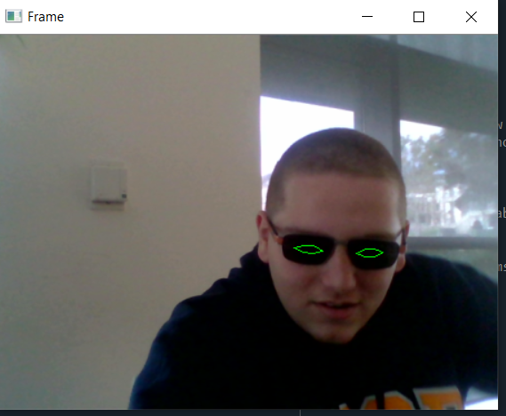

# Swaying-Attention
## Brief Overview
This project was created during the COVID-19 pandemic, when classes were online and many students were subject to sleeping during class, a problem we set out to solve. To achieve this we used OpenCV, D-lib, Arduino-C, and an ESP32 board. 

## Eye-Tracking
Using OpenCV, we are able to detect eye location based on facial proportions. The gif below shows the user (Yusuf) wearing sunglasses and still having the location of his eyes detected.

## Final Result
Using Arduino, we made sure that once our Python code identifies the user activity as drowsiness (read more about this in our report linked below), a buzzer begins to vibrate and continues to do so until the user opens their eyes. The gif below shows the buzzer and LED screen responding to the user (Pranav) dozing off.

## LaTeX Report
Press [here](https://github.com/ymorsi7/SwayingAttention/blob/main/SwayingAttention.pdf) to see the report we wrote about this project using LaTeX.

## About
For our final project in our Rapid Software and Hardware Design course at UCSD, we used some of the skills we learned throughout the quarter to create a design that we had in mind. Swaying Attention is a project that aims to tackle the problem of dozing off during online class. Students not paying attention in class was a problem when school is in person but now that most students are doing school online as a result of quarantine the problem has gotten a lot worse. Many students, including ourselves, have a hard time paying attention in online lectures and end up missing a major portion of the content. To solve this problem we created Swaying attention, a program that uses eye detection to track students dozing off and gives them a reminder to stay focused. To achieve this we used Python, OpenCV, D-lib, Arduino-C code and a Sparkfun ESP32 board. Our prototype is able to detect drowsiness and outputs a message to the student on a display as well as making noise with a buzzer to get their attention.
